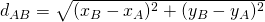

##Course project "Cost Optimisation for a package delivery drone" in course EN618(Modeling and analysis of energy systems) 

# A genetic algorithm for solving the Vehicle Routing Problem
This is a command-line interface program written in Python language for solving the VPR, minimizing the costs of it's routes.


There are 4 major files -
1. vrp.py -- It's the main file of program which invokes other files imported in it
2. k_mean.py -- This file implement k_mean algorithms for 10000 fixed maximum iterations
3. k_mean_plot.py -- This file is used to plot clusters and data point obtained from k_mean
4. animation.py -- This file takes optimal sol and the optimal k value and animate the path of drones


## Input data (xls format)
	# This is a comment line
	  ...	
	nodes:
	  [node-name] [demand-value] [position-x] [position-y]
	  ...

Lines started with ```#``` are comments, then ignored by the program.

All the strings of the input are case-sensitive


### Nodes
In ```nodes:``` block, it's defined the nodes of the VRP.

1. ```[node-name]``` --name of the node;
2. ```[demand-value]``` the demand at the specify node;
3. ```[position-x]``` x coordinate of the node;
4. ```[position-y]``` y coordinate of the node.

The node of the depot is implicitly pré-defined, with ```depot``` label, demand ```0``` and position xy ```(0, 0)```.

#### Costs

The cost of the path from a node to another is calculated by the euclidian distance between them.

The formula below is the calculation of the distance between the nodes A and B:



## Output data format

	  route:
	depot
	first-visited-node
	another-node
	...
	depot
	  cost:
	[total-cost-value-of-the-routes]

In ```route:``` block, each line is the label of the visited node, in sequence.


## Running the program

```bash
python vrp.py [population-size] [number-of-iterations] input-file.xls [Maximum-available-Drones] [Maximum-number-of-clusters] [speed-param-to-control-animation-speed]
```

Required params:

1. ```[population-size]``` is an integer positive number that specifies the number of individuals of each generation in the genetic algorithm;
2. ```[number-of-iterations]``` is an integer positive number that specifies the number of iterations (population generations) of the genetic algorithm.

Replace ```input-file.xls``` by the file from you want to read the input

3. '''[Maximum-available-Drones]''' is an integer value specifies the maximum available drones of capacity 10
4. '''[Maximum-number-of-clusters]''' is the an integer value specifies the maximum clusters we want to make
5. '''[speed-param-to-control-animation-speed]''' is the integer value to control interval inside the animation. give value in range 100 to 10000

### Example

Command to run:
```bash
python3 vrp.py 100 300 data-2.xls 20 3 800
```

Input:

     node1	0.331	-6.238	-9.76
     node2	4.239	2.141	-11.34
     node3	4.048	1.675	10.392
     node4	8.926	4.872	-1.665
     node5	1.346	0.407	4.963
     node6	2.588	7.111	-3.269
     node7	3.915	1.035	11.662
     node8	8.971	0.67	2.12
     node9	2.781	5.987	12.363
     node10	7.322	0.751	5.576


Output:
for k: 1 and i: 0
route:
	depot
	node10
	depot
	node9
	node6
	node2
	node1
	depot
	node4
	depot
	node8
	depot
	node5
	node7
	node3
	depot
Drone required: 5
 cost:
108.650089

for k: 2 and i: 0
route:
	depot
	node5
	node7
	node3
	depot
	node9
	depot
	node10
	depot
	node8
	depot
Drone required: 4
 cost:
66.828448

for k: 2 and i: 1
 route:
	depot
	node1
	node2
	node6
	depot
	node4
	depot
Drone required: 2
 cost:
47.712065
Feasible Cost: 108.65008881534357

 Printing the optimla path in terms of node
 route: 0
	depot
	node10
	depot
 route: 1
	depot
	node9
	node6
	node2
	node1
depot
 route: 2
	depot
	node4
	depot
 route: 3
	depot
	node8
	depot
 route: 4
	depot
	node5
	node7
	node3
	depot
count 5
Welcome to animation paer

##Results
Thank You